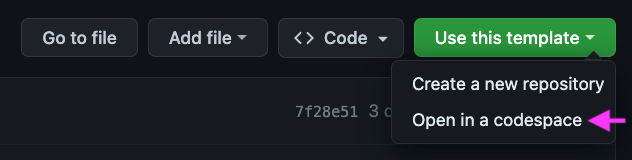
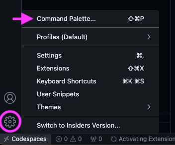

# SmartPy Environment Setup Guide

## Table of Contents

- [SmartPy Environment Setup Guide](#smartpy-environment-setup-guide)
  * [Table of Contents](#table-of-contents)
  * [Introduction](#introduction)
    + [Permissions and pop-ups](#permissions-and-pop-ups)
  * [How to create a Codespace](#how-to-create-a-Codespace)
  * [Orientation](#orientation)
    + [The Command Palette](#the-command-palette)
    + [The .devcontainer folder](#the-devcontainer-folder)
    + [How to use Codespaces with your local version of VS Code](#how-to-use-codespaces-with-your-local-version-of-vs-code)
    + [How to stop your Codespace](#how-to-stop-your-Codespace)
    + [How to reconnect to your Codespace](#how-to-reconnect-to-your-codespace)
    + [How to connect to your own fork of the tutorial repository](#how-to-connect-to-your-own-fork-of-the-tutorial-repository)
    + [Next steps](#next-steps)
  * [How to set up a local devcontainer (advanced)](#how-to-set-up-a-local-devcontainer--advanced-)
    + [Prerequisites](#prerequisites)
    + [Instructions](#instructions)
    + [A note on performance for local devcontainers](#a-note-on-performance-for-local-devcontainers)
  * [Troubleshooting](#troubleshooting)

## Introduction

This readme will guide you through setting up a working smartPy environment with as little fuss as possible using modern development tools (devcontainers). Devcontainers promote easy sharing of code, reproduction of bugs, and a predictable development environment.

We will first create a smartPy environment with Codespaces. Codespaces is a Microsoft product which allows us to work in a pre-built remote coding environment in the browser. It is free for our purposes (60 hours of free usage per user, per week).

For most readers, the setup will end here and they can skip to the smartPy tutorial.
More advanced users may wish to continue through the advanced section of setup guide, which provides instructions for how to create a smartPy container and volume on your local machine.

### Permissions and pop-ups

Throughout this guide you may encounter pop-ups or detours asking you to grant permission for particular activities such as opening VS Code from the browser, installing extentions and authorising github access. These haven't been detailed in the guide as they will differ between users. However, these are expected and you will have to grant appropriate access to complete the guide.

## How to create a Codespace

1. Create an account at github.com
2. Navigate to https://github.com/grum-tez/smartPyDC (this very page)
3. Click _Use this template_, then click _Open in a codespace_.

This will clone a copy of the template repository to a remote server (a 'codespace'). When the codespace is created, an in-browser version of Visual Studio Code will provide you access to the repository.

Your codespace should now be up and running. Everything you need to complete the tutorial, including smartPy, is pre-installed.

## Orientation
If you are new to Visual Studio Code, here are a few shortcuts and hints to help you to orient yourself

### The Command Palette
The Command Palette is a searchable menu that provides access to many commands in VS Code. To open it, click the gear icon in the bottom left hand corner of the screen and select *Command Palette*.

You will use the Command Palette often enough that it is well worth learning the keyboard shortcut!

**Command Palette keyboard shortcuts:**

| Operating System | Shortcut                  |
|------------------|---------------------------|
| Windows/Linux    | Ctrl + Shift + P          |
| macOS            | Shift + Command + P (⇧⌘P) |

Try it out - search for "View: Toggle Terminal" in the command palette. Notice that the keyboard shortcut for *Toggle Terminal* appears alongside the command.

**Toggle Terminal keyboard shortcuts:**

| Operating System | Shortcut                  |
|------------------|---------------------------|
| Windows/Linux    | Ctrl + \                  |
| macOS            | Control + Backtick (^\`)  |

This is another shortcut worth remembering!

### The .devcontainer folder

You will notice your workspace contains a single folder called ".devcontainer".

 This contains configuration files which allow the repo to run in a "Development Container". This keeps the development environment constant across systems. This will helpful in the future for sharing and communicating with others. The devcontainer allows you to share your repo and the development environment you are working in. This means your code will work more consistently across machines, and it will be easier for others to reproduce the bugs when you need help. For now, just leave the files in the .devcontainer folder alone.

### How to use Codespaces with your local version of VS Code

If you are familiar with VS Code and wish to use your natively-installed VS Code instead of an in-browser instance, open the command palette and select "Codespaces: Open in VS Code Desktop".

You may be prompted to install the Codespaces extension. If so, accept.

If you are happy to work in the browser or don't want to install VS Code, you can skip this section without disadvantage.

### How to stop your Codespace

When you are finished working in your codespace, you should stop your Codespace before you exit VS Code. This will prevent wastage of your 60 hour quota of weekly free Codespace time.

1. If you are currently connected to a Codespace, you will see this in the bottom left corner of your VS Code window:

2. Click on the word 'Codespaces'. This will open the command palette. Select "Stop Current Codespace".

3. Confirm you are disconnected

_Codespace in local VS Code_:

 If you now see only this at the bottom left of your VS Code window ... 

... that means you have successfully stopped the remote, and have been disconnected

_Codespace in Browser_:

 You should see something like this:

With default settings, your codespace will automatically stop after 30 minutes of inactivity. So if you forget to stop in the context of the smartPy tutorial, it won't be a big deal. However, it is good to get into a habit of stopping a codespace when you aren't using it.

### How to reconnect to your Codespace

If you close your Codespace part way through the tutorial and you want to get back to your work in progress, go to [https://github.com/codespaces](https://github.com/codespaces). After you sign in with your github account, will see your codespaces listed on this page. If you are new to codespaces, there will only be one item in the list.

**To reconnect:**

1. Click on the meatballs[*](https://twitter.com/MichaelBabich/status/608618153757802497) menu (the three dots) at the right hand side of your corresponding codespace.

2. Click 'Open in ...'

3. Click 'Open in browser' or 'Open in VS Code' as you prefer

This will return you to your codespace and work in progress.

### How to connect to your own fork of the tutorial repository

If you are familiar with using git and would like to add and commit your changes to a github repository, follow the instructions below. You can complete the SmartyPy tutorial without creating your own fork - however be aware that by default your work in the codespace will be automatically deleted after 30 days of inactivity. This section assumes familiarity with the [basics of git and github](https://www.freecodecamp.org/news/learn-the-basics-of-git-in-under-10-minutes-da548267cc91/).

**To connect to your own fork:**

1. In the Activity Bar on the left hand side of the screen, click the Source Control view.

2. An automatic change has already been made to folder as part of the Codespace setup: the 'smartPy' script was downloaded. 

To stage all changes, click the **+** symbol on the line next to the word *changes* (it will appear when you mouseover the word *changes*)

3. To commit your staged changes, type a commit message, for example "initial commit", and then click Commit.

4. Click Publish Branch.

5. In the "Repository Name" dropdown, leave the default repo name as 'smartPyDC', and then select 'Publish to GitHub public repository'.

### Next steps

Whether or not you chose to continue in your browser or to set up a github fork, you are now ready to complete the tutorial in a Codespaces environment. 

If you are a relative beginner to development, don't know what a container is, or are simply impatient to get started, we recommend moving directly on to the tutorial by following the link below:

[Take me to the tutorial...](https://www.lipsum.com/)

## How to set up a local devcontainer (advanced)

If you are an advanced user you may wish to continue with the instructions below to set up your environment in a local container. This means you will run your code on your local machine rather than in remote codespace.

This might be a good option for you if:

- you plan to transition directly from learning SmartPy to building with it
- you want to _learn_ in the same environment in which you will _build_ (and codespaces isn't your preferred development environment!)
- you don't want to be dependent on codespaces
- you want to save your free codespaces hours for other uses (you have 60 free CPU hours per week)
- you've got a powerful machine and want to take advantage of it to get the smoothest possible development experience
- you either know something about containers and docker already, or you are happy to learn how to use them going forward (so you can manage containers and volumes on your machine)
- you have a reasonable amount of hard drive space (each local container / volume you maintain will take up 2gb)

### Prerequisites

- Install [Docker Desktop](https://www.docker.com/products/docker-desktop/). 
  - If you are on 2021 or later Apple machine, you may have to select the "apple chip" download option.
  - Make sure Docker is installed *and running*. If you restart your machine, you may have to remember to reopen it.

- Install [Visual Studio Code](https://code.visualstudio.com/download). 
  - Make sure you are logged in with your github credentials. You can check by clicking on the icon of the portrait on the bottom left of the VS Code window.

- Install the Visual Studio Code "Dev Containers" extension
  - You might find this extension has already been installed.

- You must create a fork of the repo in your github account (if you have not already done so as part of [previous instructions](#how-to-connect-to-your-own-fork-of-the-tutorial-repository)
)

### Instructions

1. Open VS Code. If you are connected to a remote (e.g your codespace), close this connection first by following instructions in the [Exiting your codespace](#exiting-your-codespace) section.

2. Open the command palette and select "Clone Repository in Container Volume..."

3. Select your fork of the smartPyDC repository.

4. The prompt will ask you to choose a branch. Select "main".

5. A VS Code window will open in a local container volume. 

You will see this in the bottom left of your window:

The container may take a few minutes to build.

- You now have a local container running with a local volume on your machine.
- This volume will persist on your hard drive until you manually delete the container using docker.
- Your container is a git repo and already connected to your fork. You can confirm this by entering `git remote -v` in the terminal. This should show the address of your fork of the repo on github.

You are now ready to continue with the tutorial in your local container.

You're done! You are ready to start the smartPy Tutorial

[Take me to the tutorial...](https://www.lipsum.com/)

### A note on performance for local devcontainers

The option of a container combined with a local volume provides the best performance. This comes at the cost of an increased use of hard drive space. If you opt to use a container but without a local volume (instructions not given here), you may find that commands such as `npm install` and `yarn install` perform poorly (slowly).

## Troubleshooting

- If you encounter issues where your devcontainer volume in VS Code won't open, try the following solution: reopen Docker Desktop, restart VS Code and try again.

- If you encounter problems with Docker while setting up a local devcontainer and volume, try the following:
  1. Make sure you downloaded the correct version of Docker Desktop (i.e if you are on an M1 or M2 mac, be sure you downloaded the apple chip version) 
  2. Check that Docker Desktop is open, not just installed.
  3. Install the Docker extension for VS Code. Restart VS Code. Try again.
  4. Give up for now! Continue with the SmartPy tutorial using codespaces.
